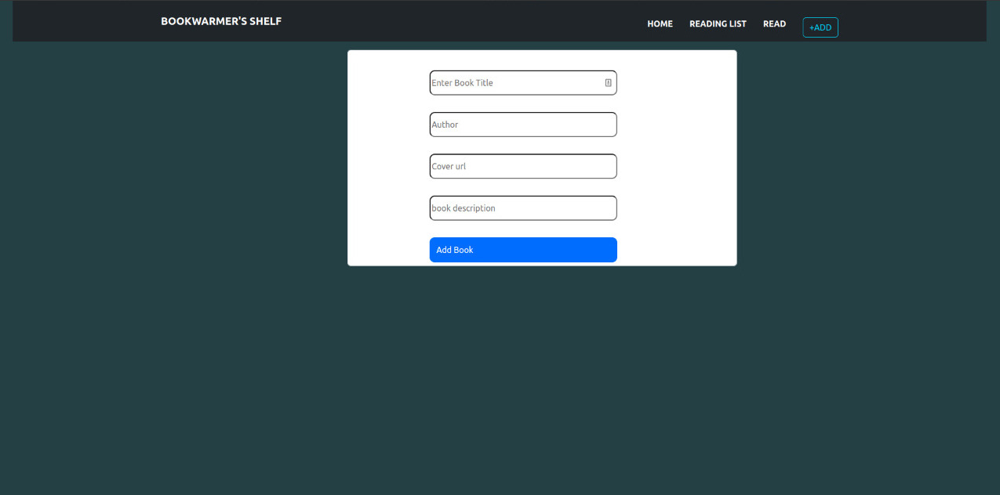
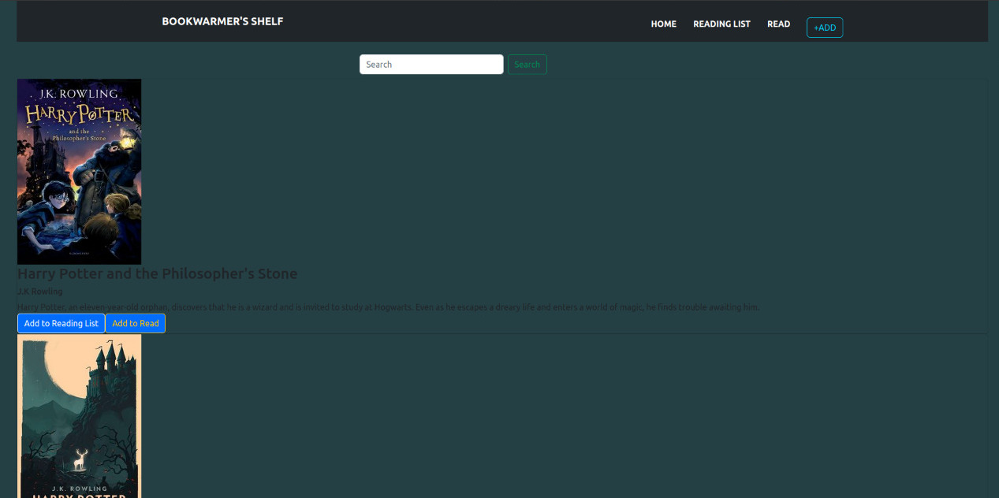

# **Bookwarmer's Shelf**
### By Brayarn Oduor
## Description
Bookwarmers' Shelf is a book planner or book tracker that allows a reader to add the books they plan to read during the month, and mark them as "read" once they are done with them. The read books are moved to another section/page for the reader to keep track of their reading journey. In addition, they can also go back to the books for rereads.

## Screenshots


### Link to site
https://ogedabrayarn.github.io/bookwarmers-shelf/
## Installation
### Requirement
* PC, Ipad, tablet or phone
* Access to internet connection
* Text editor

### Installation Process
clone repo
```
git clone https://github.com/ogedabrayarn/my-bookwarmers-shelf.git
```
Install
```
npm install
json-server --watch db.json
npm start
```
## Tools Used
- main: react.js, SPA html
- UI: bootstrap, css
- other libraries: react-router-dom, db.json

## Known Bugs
- Styling the div horizontally and implementing <b>Context API(Global storage)</b>
## License
MIT License

Copyright (c) 2022 Brayarn Oduor

Permission is hereby granted, free of charge, to any person obtaining a copy of this software and associated documentation files (the "Software"), to deal in the Software without restriction, including without limitation the rights to use, copy, modify, merge, publish, distribute, sublicense, and/or sell copies of the Software, and to permit persons to whom the Software is furnished to do so, subject to the following conditions:

The above copyright notice and this permission notice shall be included in all copies or substantial portions of the Software.

THE SOFTWARE IS PROVIDED "AS IS", WITHOUT WARRANTY OF ANY KIND, EXPRESS OR IMPLIED, INCLUDING BUT NOT LIMITED TO THE WARRANTIES OF MERCHANTABILITY, FITNESS FOR A PARTICULAR PURPOSE AND NONINFRINGEMENT. IN NO EVENT SHALL THE AUTHORS OR COPYRIGHT HOLDERS BE LIABLE FOR ANY CLAIM, DAMAGES OR OTHER LIABILITY, WHETHER IN AN ACTION OF CONTRACT, TORT OR OTHERWISE, ARISING FROM, OUT OF OR IN CONNECTION WITH THE SOFTWARE OR THE USE OR OTHER DEALINGS IN THE SOFTWARE
## Author details
- Email: brayarn.oduor@student.moringaschool.com
